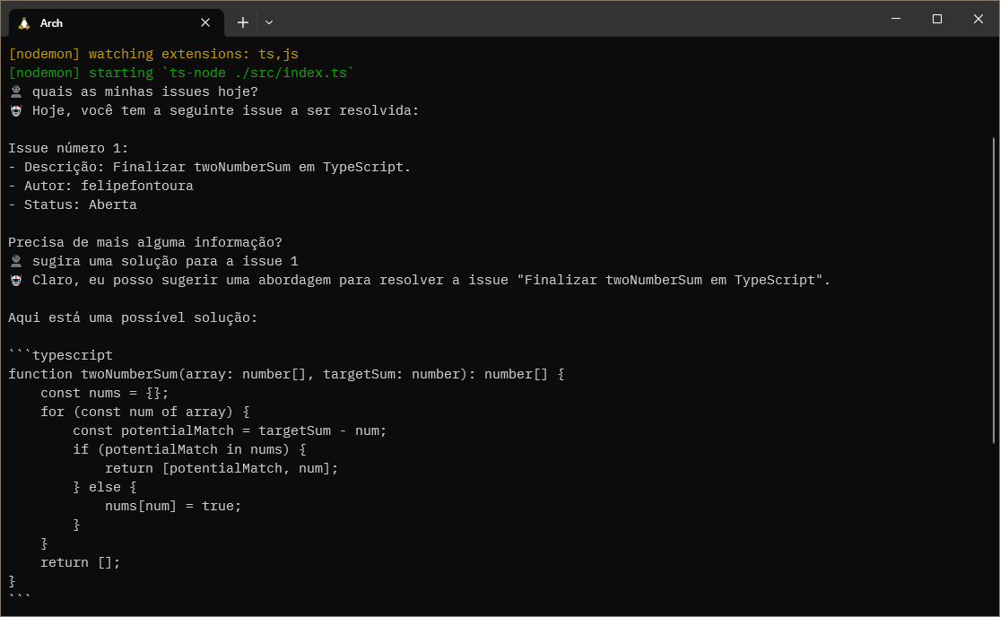

# My Jarvis

Assistente pessoal utilizando OpenAI GPT-4 e call functions.

Com este projeto você vai criar o seu próprio assistente virtual utilizando o OpenAI GPT-4 e call functions realizando integrações com os mais diversos serviços, como por exemplo, Github.

Ele foi desenvolvido para o conteúdo da [Master Class #20](https://www.youtube.com/watch?v=LVkyceIOs7s) da [Dev Samurai](https://devsamurai.com.br).



## Como funciona

Com a nova integração chamada call functions, a Open AI mais uma vez revolucionou o mercado de inteligência artificial 'executar códigos' de qualquer linguagem de programação.

Com isso criamos algumas funções úteis para um assistente virtual e seu amo, o dev. Assim automatizando as tarefas mais chatas como:

- Escrever a sua daily
- Enviar emails programados para sua gerente
- Consultar issues e pull requests dos seus projetos
- *e mais...*

Isso é apenas o início, já que com essa estrutura você poderá facilmente acomplar mais e mais funções criando um verdadeiro Jarvis GPT 🤖.

## Como executar

Clone  o projeto na sua pasta de desenvolvimento:

```sh
git clone git@github.com:DevSamurai/my-jarvis.git
```

E acesse a pasta do projeto e execute o seguinte comando:

```sh
cd my-jarvis
npm install
npm run dev
```

Lembrando que para executar o projeto você precisa ter o Node.js instalado na sua máquina e uma conta na OpenAI.

## Como acompanhar o meu trabalho

Se você curtiu esse conteúdo, vai curtir também minha newsletter, inscreva-se em <https://st.devsamurai.com.br/f7tvr6rx/index.html>
